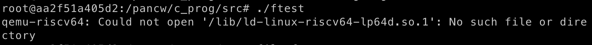

## 个人信息

学号 - 3180104719

姓名 -  潘楚文 

[toc]


## 实验环境

macOS Montery 12.6 (Apple M1 chip)

Docker Desktop 20.10.17

## Docker Ubuntu配置

### 创建ubuntu容器 并实现将本机中的某个文件夹挂载到容器中

#### 从docker server中pull ubuntu 22:04

```sh
docker pull ubuntu:22.04
```

#### 挂载(mount)的目的和相关命令

挂载的目的: 这样能够在vscode里看linux代码，又能在ubuntu配置好的环境中使用qemu和gdb来编译调试.

例如上面的命令中冒号前面的 `"$(pwd)/mountdir" `指本机(host machine)的文件夹， 冒号后面的`/pancw`指在容器根目录中创建对应目录的名称.  

```sh
docker run -it --name ubuntu -v "$(pwd)/mountdir":/pancw ubuntu-config bash
```


> 图中左边是docker ubuntu bash, 右边是本机的zsh，可以看到文件都是一一对应的(无论在哪边更改文件，另一边也能立即反映出来)


需要注意的是挂载需要在容器创建一开始就做好，如果已经使用``docker run`命令创建了容器则不能再执行上面的语句了，需要用commit container命令创建对应image，用新的image 配合`docker run -v` 重新创建新容器，然后把旧的容器删了


#### 其他一些docker相关命令

停下容器(一般来说我们不会主动执行，可能关机导致docker自动将某个容器停止了)

```sh
docker stop ubuntu
```

这时候我们需要执行以下两条指令来重新打开docker ubuntu bash

```sh
docker start ubuntu
```

```sh
docker exec -it ubuntu bash
```


### 在docker ubuntu上安装工具

这一块没什么好说的，跟着实验指导4.1做就行，要注意是在ubuntu上安装而不是在本机上安装。

#### gcc git curl 等必要工具

```sh
$ sudo apt install  gcc-riscv64-linux-gnu
$ sudo apt install  autoconf automake autotools-dev curl libmpc-dev libmpfr-dev libgmp-dev \
                    gawk build-essential bison flex texinfo gperf libtool patchutils bc \
                    zlib1g-dev libexpat-dev git

```

#### qemu

```sh
$ sudo apt install qemu-system-misc
```

为什么要用qemu: 虽然我们使用了docker ubuntu，更改了我们的OS，但这个ubuntu还是运行在Apple M1 chip之上的，而我们需要执行的程序是基于risc-v的(按道理应该在riscv架构上的PC编译)，qemu做的事情就是模拟出这样一个riscv架构的PC平台，让这些riscv的程序能够正常执行。

#### gdb-multiarch

```sh
$ sudo apt install gdb-multiarch
```


## 编译(make/build)内核

#### 编译内核的最终结果是什么？

 `./vmlinux`和 `./arch/riscv/Image`

<figure>
   
</figure>

> 由于我们在编译时声明了架构 `ARCH=riscv`, 因此只有在 `./arch/riscv/boot/`下有`Image`产物


##### `vmlinux` 和` Image` 有什么区别？

同样用`find` 命令找出文件路径后加上 `file` 命令查看文件类型，可以看到`vmlinux`是ELF文件(可链接可执行文件，除了代码本身还有符号表这些内容)，而Image是 MS-DOS 可执行文件。

`vmlinux` 是内核编译最原始的结果，没有任何信息损失或经过压缩，拥有符号表和重定位信息，一般用于debug。

`Image`是`vmlinux`经过[objcopy](https://web.mit.edu/gnu/doc/html/binutils_4.html#:~:text=The%20GNU%20objcopy%20utility%20copies,controlled%20by%20command%2Dline%20options.) 后得到的二进制文件，它去除了`vmlinux`中的符号表和重定位信息，一般只用于执行。

`Image`还可以被压缩为`zImage`和`bzImage`等文件，但这不是实验重点，这里就不进一步解析了。

 


####  编译内核第一步：用 `./arch/riscv/configs/defconfig`编译出 `.config`

```sh
cd /pancw/linux/ && make ARCH=riscv CROSS_COMPILE=riscv64-linux-gnu- defconfig
```

##### 为什么需要产生`.config`文件？

linux的内核版本更迭非常频繁，而每个新版本都会有新的特性(和新的内核编译设置选项)。为了避免每次更新都要单独更改某个庞大的config文件，linux将config文件分成了两部分：`defconfig`用于存储一些通用的选项，而另一部分则是一些`Kconfig`文件，当执行`make config`命令时linux会遍历该体系下所有子目录，将`Kconfig` 中提到的选项覆盖`defconfig`, 这两者综合起来就产生了`.config`文件。

##### `.config` 里有什么？

```sh
#
# Automatically generated file; DO NOT EDIT.
# Linux/riscv 5.19.0 Kernel Configuration
#
CONFIG_CC_VERSION_TEXT="riscv64-linux-gnu-gcc (Ubuntu 11.2.0-16ubuntu1) 11.2.0"
CONFIG_CC_IS_GCC=y
CONFIG_GCC_VERSION=110200
CONFIG_CLANG_VERSION=0
...
```

上面是`.config`中的开头，可以看到注释里已经说明`.config`是由规则自动生成的。在理解`.config`的产生过程后我们无需更改该文件。


##### 编译内核第二步：根据`.config`的设置编译内核

```sh
cd /pancw/linux && make ARCH=riscv CROSS_COMPILE=riscv64-linux-gnu- -j$(nproc)
```

执行该命令后会经过较长时间的编译过程(大概30分钟左右)，编译完成后会得到 `./vmlinux` 和 `./arch/riscv/Image`

 

> 编译的过程，会输出编译得到的中间文件

## 使用QEMU+GDB进行内核调试

内核编译玩成后，我们需要开2个docker ubuntu的终端。终端1用于QEMU运行已经编译好的内核，终端2用GDB来调试终端1中正在运行的内核，我们需要设置参数让这两个终端连接起来。

#### Terminal1: QEMU running kernel

```sh
cd / && qemu-system-riscv64 -nographic -machine virt -kernel /pancw/linux/arch/riscv/boot/Image \
    -device virtio-blk-device,drive=hd0 -append "root=/dev/vda ro console=ttyS0" \
    -bios default -drive file=/pancw/os22fall-stu/src/lab0/rootfs.img,format=raw,id=hd0 -S -s
```

如果对参数不是很清楚，可以使用 -help + grep 的组合来查阅

例如我对 `-s` `-S` `-drive` 这些选项不是很清楚，可以使用这些命令来查询

```sh
qemu-system-riscv64 -help | grep "\-S "
```

```sh
qemu-system-riscv64 -help | grep "\-s "
```

 

`-drive`的解释比较长，我们可以用`-A 20` 来显示额外20行的信息

```sh
qemu-system-riscv64 -help | grep "\-drive" -A 20
```

   

`rootfs.img`

这里用到了lab0中的`rootfs.img`. rootfs = root file system. 理解rootfs和`rootfs.img`的作用需要彻底理解linux的booting过程，在lab1中会进行详细解析。

#### Terminal2: GDB debug

```sh
cd / && gdb-multiarch /pancw/linux/vmlinux
```

要注意需要在终端1中启动QEMU，不然GDB找不到程序


#### 具体步骤

在终端1中输入指令并运行后，由于命令中有`-S`和`-s`选项，会等待另一端(GDB)的端口连接


此时在终端2中启动GDB，但由于我们还没有在GDB中声明连接端口，所以QEMU和GDB并没有找到对方


在GDB中输入`target remote :1234`


#### 为什么找不到debugging symbols？


 

##### 尝试1: 更改`.config`中的选项

查看 `.config` 后发现其中`CONFIG_DEBUG_INFO_NONE`选项被设置成了y(意思是没有debug info)

```assembly

# .config file code snippet
# Compile-time checks and compiler options
#
CONFIG_DEBUG_INFO_NONE=y
# CONFIG_DEBUG_INFO_DWARF_TOOLCHAIN_DEFAULT is not set
# CONFIG_DEBUG_INFO_DWARF4 is not set
# CONFIG_DEBUG_INFO_DWARF5 is not set
CONFIG_FRAME_WARN=2048
CONFIG_STRIP_ASM_SYMS=y
CONFIG_READABLE_ASM=y
```

前面提到过`.config`是由`defconfig`和众多`Kconfig`文件生成的。我尝试在`linux/arch/riscv/defconfig`最后添加以下两行代码

```asm
#defconfig
...
CONFIG_RCU_EQS_DEBUG=y
# CONFIG_FTRACE is not set
# CONFIG_RUNTIME_TESTING_MENU is not set
CONFIG_MEMTEST=y
#added line for debug #pancw
CONFIG_DEBUG_INFO=y
CONFIG_FRAME_POINTER=y
```

使用make defconfig重新编译后提示`.config`没有任何变化，此方法无效


##### 尝试2: 通过内核的menuconfig改变debug设置

使用make menuconfig(需要提前安装libncurse支持GUI显示)

```sh
cd /pancw/linux/ && make ARCH=riscv CROSS_COMPILE=riscv64-linux-gnu- menuconfig
```

进入kernel hacking，发现其中kernel debugging已经默认打上勾了，查看其他debug选项也没有找到解决方法

 

##### 尝试3: 最后更改 `linux/Makefile`中的KBuild参数, 在末尾加上 `-g`

```makefile
KBUILD_CFLAGS   := -Wall -Wundef -Werror=strict-prototypes -Wno-trigraphs \
		   -fno-strict-aliasing -fno-common -fshort-wchar -fno-PIE \
		   -Werror=implicit-function-declaration -Werror=implicit-int \
		   -Werror=return-type -Wno-format-security \
		   -std=gnu11 \
		   -g
```

 

> 能够读取symbol table了！问题可能不在于`.config`中的那个选项设置，而在于编译时命令行参数(也就是Makefile)的flag设置问题，就像用gcc编译单个`.c`文件时需要加上`-g`后才能用gdb debug一样


### 在该问题解决后重新启动QEMU+GDB进行调试


##### 在某个函数(例如start_kernel)处设置断点(breakpoint)

```gdb
b start_kernel
# OR use full name 
break start_kernel
```

 

##### 在某个地址(例如0x80000000)处设置断点

```
b *0x80000000
b *0x80200000
```

  

#####   查看所有断点

```
info break
info b
```

 

##### 撤销某个断点(一般要用info先查看所有断点)

```
del 2
```

 

> 删除了第2个断点(位于0x8000_0000)


##### 执行直到碰到断点

```
c
continue
```

 

> 提示我们碰到了第3个断点

 

> 此时QEMU terminal会显示OpenSBI的字样

 

> 继续执行，碰到第1个断点，到达`start_kernel()`函数a

##### 查看代码(.c)

```
layout src
```

 

##### 单步执行原代码

```
n
next
```

 

> 注意行号左侧的B+和小箭头，B+代表断点，>表示当前执行的指令行号

##### 查看汇编代码

```
layout asm
```

 

##### 单步执行汇编代码

```
si
```

 

ni和si有差别

##### 查看第102-120行的程序

```sh
list 102，120
```

##### 进入函数

```
step
s
```


#### 结束调试

 

> 调试结束后，先在右侧GDB输入`exit` , gdb 会提示你有活跃的程序运行(就是QEMU)，输入y

 

> 此时gdb会成功退出，由于失去了gdb的调试约束，QEMU会运行linux kernel，并提示我们按Enter来激活该kernel自带的console

 

> 这个shell和docker ubuntu的bash不是同一个shell，输入`ls`指令可以观察它内部的结构

 

> 在QEMU内按下 control + A , 再按下X即可成功退出

## 其他

#### 使用riscv交叉编译链编译单个文件

```sh
cd /pancw/c_prog && riscv64-linux-gnu-gcc ftest.c -o ftest
```

编译出来的可执行文件需要在riscv架构下才能执行，我们是无法在docker ubuntu中直接执行的，会报错

 

我们可以生成编译的中间文件`ftest.S`，里面包含了riscv汇编代码

```sh
cd /pancw/c_prog && riscv64-linux-gnu-gcc ftest.c -S -o ftest.S
```

```assembly
.file	"ftest.c"
	.option pic
	.text
	.section	.rodata
	.align	3
.LC0:
	.string	"The value of g is %d\n"
	.text
	.align	1
	.globl	printMessage
	.type	printMessage, @function
printMessage:
	addi	sp,sp,-48
	sd	ra,40(sp)
	sd	s0,32(sp)
	addi	s0,sp,48
	mv	a5,a0
	sw	a5,-36(s0)
	lw	a5,-36(s0)
	addiw	a5,a5,5
	sw	a5,-20(s0)
	lw	a5,-20(s0)
	...
```

##### 使用 riscv-objdump 反汇编(disassemble) ftest

```sh
riscv64-linux-gnu-objdump -d ftest > ftest_objdump.S
```


> 左代码框`ftest_objdump.S`是`fest`经odjdump后的汇编代码，右代码框`ftest.S`是由`ftest.c`编译生成的中间产物


#### 清除make中间产物(make clean)

```none
# Cleaning is done on three levels.
# make clean     Delete most generated files
#                Leave enough to build external modules
# make mrproper  Delete the current configuration, and all generated files
# make distclean Remove editor backup files, patch leftover files and the like
```


## compiler review


