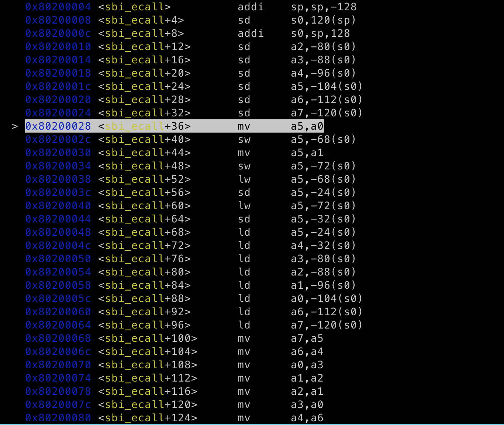

# lab1-内核引导

[toc]

## 实验环境

macOS Montery 12.6 (Apple M1 chip)

Docker Desktop 20.10.17

## 准备工作

编译

```sh
cd /pancw/os22fall-stu/src/lab1 && make
```

QEMU

```sh
cd /pancw/os22fall-stu/src/lab1 && qemu-system-riscv64 -nographic -machine virt -kernel $(pwd)/arch/riscv/boot/Image \
    -device virtio-blk-device,drive=hd0 -append "root=/dev/vda ro console=ttyS0" \
    -bios default -drive file=/pancw/os22fall-stu/src/lab0/rootfs.img,format=raw,id=hd0 -S -s
```

如果嫌指令太长不想打的话可以直接在根目录的 `MakeFile`里更改规则(已经帮我们写好了)

```sh
make debug
```

GDB

```sh
cd /pancw/os22fall-stu/src/lab1 && gdb-multiarch $(pwd)/vmlinux
```

为了方便，我在`~/.bashrc`中添加了`mygdb`函数和对应的环境变量

 

```
mygdb lab1
```

现在直接输入`mygdb lab1`就可以启动gdb来调试lab1的vmlinux了

 


## 能够编译出vmlinux

我们的第一个目标是能够编译出vmlinux，为此我们需要完善`head.S` 和 `lib/Makefile`. 后续的`sbi.c` 和 相关函数实现并妨碍vmlinux的编译。

### 编写head.S

在`head.S`中我们需要完成3件事情：

1. 在`boot_stack:` 中设置栈
2. 在`_start:` 中将栈的初始地址用`la` 指令赋给`sp`寄存器
3. 使用`j`指令跳转到`start_kernel` 

```asm
.extern start_kernel

    .section .text.entry
    .globl _start
_start:
    # ------------------
    # - your code here -
    # ------------------
    la sp, boot_stack
    j start_kernel
    .section .bss.stack
    .globl boot_stack
boot_stack:
    .space 4096 # <-- change to your stack size

    .globl boot_stack_top
boot_stack_top:
```

> 知道要做什么之后非常简单，但是我在做的时候忘记做第二步，没有设置sp导致后续调试遇到了很多奇怪的问题

### 编写 lib/Makefile

 

`lib/`目录下只有`print.c`一个文件，在理解了Makefile的规则后我发现`init/`目录下的Makefile和我们要写的Makefile要完成的任务一模一样(编译当前文件夹下所有`.c`文件)，因此我把`init/Makefile`中的内容拷贝到了`lib/Makefile`下


## 编写sbi_ecall( ), 打印单个字符

编写 `sbi_ecall()`的关键在于理解内联汇编，并且知道调用`sbi_ecall()`时 caller 和 callee 分别要做什么.

### caller 行为

在编写 `sbi_ecall()`前我们先用gdb观察汇编代码. 在跳转到sbi_ecall前caller先将参数的值用`li`指令分别赋给a0-a7

 


```sh
i r
```

在gdb中输入查看进入`sbi_ecall()`时寄存器的值

 


### callee需要做什么

而`sbi_ecall()`中内联汇编在调用`ecall`前需要调整寄存器的位置, 见下表

| 参数名                                 | ext  | fid  | arg0 | arg1 | arg2 | arg3 | arg4 | arg5 |
| -------------------------------------- | ---- | ---- | ---- | ---- | ---- | ---- | ---- | ---- |
| 进入`sbi_ecall()`时参数对应的寄存器    | a0   | a1   | a2   | a3   | a4   | a5   | a6   | a7   |
| 参数对应的值                           | 0x1  | 0x0  | 0x30 | 0x0  | 0x0  | 0x0  | 0x0  | 0x0  |
| 执行`ecall`进入M态之前参数对应的寄存器 | a7   | a6   | a0   | a1   | a2   | a3   | a4   | a5   |


如果使用`: [ext] "r" (ext_u64), [fid] "r" (fid_u64), ..` (参数对应寄存器)，我们没法直接使用` mv a7, a0` 这样的指令，因为a7原本的值会遗失，需要先把所有寄存器的值存到栈里面

```c
....
//inline assembly
__asm__ volatile (
  	"mv x17, %[ext]\n"
  	"mv x16, %[fid]\n"
		"mv x10, %[arg0]\n"
		"mv x11, %[arg1]\n"
		"mv x12, %[arg2]\n"
		"mv x13, %[arg3]\n"
		"mv x14, %[arg4]\n"
		"mv x15, %[arg5]\n"
		"ecall\n"
		"mv %[error_code], x10\n"
		"mv %[ret_val], x11"
        : [error_code] "=r" (ret_struct.error), [ret_val] "=r" (ret_struct.value)
        : [ext] "r" (ext_u64), [fid] "r" (fid_u64), \
		  [arg0] "r" (arg0), [arg1] "r" (arg1), [arg2] "r" (arg2), [arg3] "r" (arg3), [arg4] "r" (arg4), [arg5] "r" (arg5) 
        : "a0", "a1", "a2", "a3", "a4", "a5", "a6", "a7"
    );
```

用c写的内联汇编代码编译出来的riscv代码

第一步：重新设定s0和sp, s0 对应`sbi_ecall`中stack的最高地址, sp对应stack的最低地址. 

第二步：用`sd`把a0-a7全部push进stack内

第三步:  用`ld`将原a0-a7的值按表格重新分配(例如a0->a7, a3->a1)

第四步：`ecall`

  

```sh
x/8xg $sp
```

查看栈中数据, 其中8表示显示8个单元，x表示用16进制显示，g代表每个单元为32位(giant word)

 

 可以看到栈中存放了原本a0-a7的数据


#### ecall 前寄存器的状态

 

a7没有显示, 在下一页中查看显示值为1, 符合我们的预期

### 验证 ret_struct 正确性

```c
	__asm__ volatile (
		...
		"ecall\n"
		"addi %[error_code], %[error_code], 7\n"
		"addi %[ret_val],%[error_code], 5"
    ...
```

 

一开始我在写ret_struct赋值时的思路是把整个ret_struct看作一整个64位寄存器，利用移位操作把两个32位的值赋给ret_struct对应寄存器的高32位/低32位，但后来发现把struct直接放进内联汇编代码中会报错，并且会涉及大小端的问题，还不如直接把struct的两个成员变量分别和2个寄存器相绑定，让编译器做汇编代码的转换。


## print.c 中 puti(int x) puts(char* s) 实现

这两个函数都需要调用sbi_ecall()

puts的实现非常简单，遍历整个字符串，使用sbi_ecall() 打印单个字符

```c
void puts(char *s) {
    for (; *s != '\0'; s++) {
        sbi_ecall(0x01, 0x0, *s, 0, 0, 0, 0, 0);
    }
}
```

puti的实现需要考虑性能问题。从高位到低位依次获取某个int x 每一位的ascii，一般有两种方法。方法一需用额外空间存储每一位，在循环计算时我们得到的位数是从低到高的，在计算完毕后访问数组调用sbi_ecall( ) ；要么循环2次，在第一次循环时得到整个int的位数, 第二次循环时可以用位数得到从高到低的ascii。我采取了第二种方法

```c
void puti(int x) {
    const int base = 10;
    int power = 1;
    // avoid using array 
    do
    {
        power *= 10;
    } while (x >= power);
    /*
        x = 10 -> power = 100
    */
    
    /*
        power /= 10 -> power = 10
        curDigit = '1'
        x = 10 % 10 = 0
        ...
    */

    while (power != 1)
    {
        power /= base;
        char curDigitASCII = (x / power) + '0';
        sbi_ecall(0x1, 0x0, curDigitASCII, 0, 0, 0, 0, 0);
        x = x % power;
    }
    

    sbi_ecall(0x1, 0x0, x, 0, 0, 0, 0, 0);
}
```


验证，可以看到成功打印出了`2022 Hello RISC-V`

 

## 思考题

##### 请总结一下 RISC-V 的 calling convention，并解释 Caller / Callee Saved Register 有什么区别？

###### calling convention

calling convention 主要针对的是callee(被调用的函数). 在进入callee时需要拓宽栈(通过更改sp实现)，使用`sw`指令把接下来可能会更改的所有s寄存器和ra存放进去，这部分被称为prologue. 在callee主体部分结束之后我们需要恢复栈(把sp改回进入callee前的大小)，并且通过`lw`指令恢复所有s寄存器和ra的值, 这部分又被称为epilogue.

一个例子:

```asm
sumsquares:

prologue:
addi sp sp −16
sw ra 0(sp)
sw s0 4(sp)
sw s1 8(sp)
sw s2 12(sp)
li s0 1
mv s1 a0
mv s2 0

loopstart:
bge s0 s1 loopend
mv a0 s0
jal square
add s2 s2 a0
addi s0 s0 1
j loopstart

loopend:
mv a0 s2

epilogue:
lw ra 0(sp)
lw s0 4(sp)
lw s1 8(sp)
lw s2 12(sp)
addi sp sp 16
jr ra
```

[riscv calling convention](https://inst.eecs.berkeley.edu/~cs61c/resources/RISCV_Calling_Convention.pdf) 这份资料很好的解释了riscv 的 calling convention, 有需要的读者可以查阅.

###### caller-saved/callee-saved register

caller-saved register 又被称为 volatile register. 在调用函数后这些寄存器的值大概率会发生变化(例如所有的t寄存器), 如果我们希望在调用函数后仍然使用这些寄存器，那么就需要在调用函数之前把这些值push到栈中(这个行为就是save, 由于我们当前的位置属于caller，这一类寄存器又被称为caller-saved register)

callee-saved register 又被称为 non-volatile register. 这类寄存器根据calling convention, 在callee中需要拓宽栈来保存它们(例如s寄存器). 因而在返回caller后这些寄存器的值还是和调用函数前一样


##### 编译之后，通过 System.map 查看 vmlinux.lds 中自定义符号的值（截图）

我们可以直接查看 `System.map`中的内容来获取symbol table

```sh
cat System.map
```

 

也可以用`nm` 命令来查看`linuxvm` 中存放的symbol table

```sh
nm linuxvm
```

用`diff` 命令比较这两者，没有任何输出，说明这两者的内容完全一致

```sh
diff System.map <(nm linuxvm)
```

 


用 `csr_read` 宏读取 `sstatus` 寄存器的值，对照 RISC-V 手册解释其含义（截图）。

用 `csr_write` 宏向 `sscratch` 寄存器写入数据，并验证是否写入成功（截图）。

##### 尝试使用本实验环境中提供的 `riscv64-linux-gnu-readelf` 和 `riscv64-linux-gnu-objdump` 工具，通过选择添加不同的命令行参数，解析本次实验编译所得 vmlinux文件，并截图说明。

###### readelf

```sh
riscv64-linux-gnu-readelf --help
```

查看readelf命令的相关帮助

 

选用-a 等同于查看所有信息

```sh
riscv64-linux-gnu-readelf -a vmlinux
```

 

(后面还有太多了)，也可以使用其他option单独查看特定信息，这里就不演示了

###### objdump

```sh
riscv64-linux-gnu-objdump --help
```

查看odjdump命令的相关帮助

 

例如我们选用-S, 查看vmlinux中链接后每一段对应的汇编代码和c代码

```sh
riscv64-linux-gnu-objdump -S vmlinux
```

 


##### 查看本次实验编译所得vmlinux文件的类型，简要说明该类型文件的构成，以及它与本实验所用链接脚本(vmlinux.lds)之间的联系。

```sh
file vmlinux
```

使用`file`命令查看vmlinux的文件类型

 

vmlinux为ELF文件类型

关于ELF文件的构成可以查看这篇文章[understanding ELF file format](https://linuxhint.com/understanding_elf_file_format/) 

`vmlinux.lds`就是链接器，负责链接编译生成的所有`.o`文件，`vmlinux.lds`中规定的sections在用`readelf`解析vmlinux时能够对应上


##### 探索Linux内核版本v6.0源代码，从中找到ARM32, RISC-V(32bit), RISC-V(64bit), x86(32bit), x86_64这些不同架构中的系统调用表(System Call Table)，并列出具体的文件路径。

System Call Table 是一个数组，里面存放了函数指针, 每一个函数指针都指向一个对应的系统调用函数。


###### ARM32

在vscode中按下 `cmd + p` , 输入 `arch/arm/sys` , 会跳出来很多选项

  

我们选择第一个 `syscall.tbl` , 即可查看ARM32 的 系统调用表

 

问题在于 `syscall.tbl` 只是单纯用于记录的，在linux内核中具体存储系统调用信息的那个数组到底在哪？

经过一番探索后我在arm中的`sys32.c` 找到了 `sys_call_table`这样一个数组(虽然它在arm64架构下)

 

查看 `asm/unistd32.h` 

 

可以看到其中包括ARM32架构的所有系统调用编号

###### x86(32bit)/x86_64

在vscode中搜索 `sys.tbl` , 可以找到x86的对应系统调用表(32/64都有), 内容格式和ARM的非常类似

 

 

x86的系统调用表在代码中的具体位置和ARM略有不同，在`syscall_64.c` 和 `syscall_32.c` 中

 

 

这里我跟随include一路向下走，并没有发现类似ARM中的系统调用表，最终在`unistd_64.h`中发现了以下define(并没有找到x86内核代码中的系统调用表)

 

###### riscv32/riscv64

在寻找riscv32/riscv64的系统调用表时我遇到了困难。第一个问题是riscv并没有类似ARM或x86的`syscall.tbl`, 第二个问题是虽然`riscv/kernel/syscall_table.c`中有存储riscv系统调用表的数组,  但一路跟随include最后找到的系统调用表文件`.../asm-generic/unistd.h` 并不在`arch/riscv`目录下(虽然系统调用的编号是正确的)

 

 

 

  

## 参考资料

[Why both `make clean` and `make mrproper` are used?](https://unix.stackexchange.com/questions/387640/why-both-make-clean-and-make-mrproper-are-used)

[What are the two head.S files in linux source?](https://unix.stackexchange.com/questions/139297/what-are-the-two-head-s-files-in-linux-source)

[X86 64 Register and Instruction Quick Start](https://wiki.cdot.senecacollege.ca/wiki/X86_64_Register_and_Instruction_Quick_Start)

[What are callee and caller saved registers?](https://stackoverflow.com/questions/9268586/what-are-callee-and-caller-saved-registers)

[Printing in Makefiles: @echo vs $(info )](https://stackoverflow.com/questions/47367589/printing-in-makefiles-echo-vs-info)

[What's the difference between parenthesis \$() and curly bracket \${} syntax in Makefile?](https://stackoverflow.com/questions/25185607/whats-the-difference-between-parenthesis-and-curly-bracket-syntax-in-ma)

[$(@D)](https://www.gnu.org/software/make/manual/html_node/Automatic-Variables.html#Automatic-Variables)

[What does "all" stand for in a makefile?](https://stackoverflow.com/questions/2514903/what-does-all-stand-for-in-a-makefile)

[What's the difference between := and = in Makefile?](https://stackoverflow.com/questions/4879592/whats-the-difference-between-and-in-makefile)

`DIR_DUP     = mkdir -p $(@D)` 如果右边的值会变化(例如`$(@D)`就会根据文件的位置发生变化)，那么就用`=`. 如果不会变化(例如 `CC := clang`)

[String substitution](https://www.gnu.org/software/make/manual/html_node/Substitution-Refs.html)

[What is the variable $(MAKE) in a makefile?](https://stackoverflow.com/questions/38978627/what-is-the-variable-make-in-a-makefile)

[fence fence.i](https://stackoverflow.com/questions/26374435/what-is-meant-by-the-fence-instruction-in-the-risc-v-instruction-set)

[assembly directives](https://ftp.gnu.org/old-gnu/Manuals/gas-2.9.1/html_chapter/as_7.html)

[riscv assembly reference](https://michaeljclark.github.io/asm.html)

[Is there a difference in intended meaning between .s (lower-case) and .S (upper-case) assembly files?](https://stackoverflow.com/questions/50882345/is-there-a-difference-in-intended-meaning-between-s-lower-case-and-s-upper)

[What does the ".align" directive mean in x86-64 Assembly?](https://stackoverflow.com/questions/17306784/what-does-the-align-directive-mean-in-x86-64-assembly)

[Difference between .space and .word directives](https://stackoverflow.com/questions/57927865/difference-between-space-and-word-directives)

[How to print register values in GDB?](https://stackoverflow.com/questions/5429137/how-to-print-register-values-in-gdb)

[File mount does not update with changes from host](https://github.com/moby/moby/issues/15793)

[What's the difference between nexti and stepi in gdb?](https://stackoverflow.com/questions/52024529/whats-the-difference-between-nexti-and-stepi-in-gdb)

[https://ftp.gnu.org/old-gnu/Manuals/gdb/html_node/gdb_55.html](examine memory)

[How to access data that an offset of a register in gdb?](https://stackoverflow.com/questions/3887162/how-to-access-data-that-an-offset-of-a-register-in-gdb)

[RISCV32 vs RISCV64](https://stackoverflow.com/questions/62807066/riscv32-vs-riscv64)

[How does RISC-V variable length of instruction work in detail?](https://stackoverflow.com/questions/56874101/how-does-risc-v-variable-length-of-instruction-work-in-detail)

[Do class/struct members always get created in memory in the order they were declared?](https://stackoverflow.com/questions/281045/do-class-struct-members-always-get-created-in-memory-in-the-order-they-were-decl)

[How do I revert a Git repository to a previous commit?](https://stackoverflow.com/questions/4114095/how-do-i-revert-a-git-repository-to-a-previous-commit)

[How to properly iterate through a char pointer?](https://stackoverflow.com/questions/67172701/how-to-properly-iterate-through-a-char-pointer)

[why my function in bashrc is not recognized on command line?](https://superuser.com/questions/114648/why-my-function-in-bashrc-is-not-recognized-on-command-line)

[How do you call a function defined in .bashrc from the shell? [duplicate\]](https://stackoverflow.com/questions/1500499/how-do-you-call-a-function-defined-in-bashrc-from-the-shell)

[c statement expression](https://gcc.gnu.org/onlinedocs/gcc-4.7.4/gcc/Statement-Exprs.html)

[System.map](https://en.wikipedia.org/wiki/System.map)

[How do I diff the output of two commands?](https://askubuntu.com/questions/229447/how-do-i-diff-the-output-of-two-commands)

[What is an application binary interface (ABI)?](https://stackoverflow.com/questions/2171177/what-is-an-application-binary-interface-abi)

[cscope](https://courses.cs.washington.edu/courses/cse451/13sp/tutorials/tutorial_cscope.html)

[riscv calling convention](https://inst.eecs.berkeley.edu/~cs61c/resources/RISCV_Calling_Convention.pdf)
