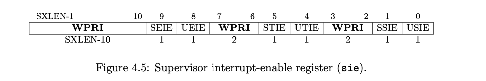
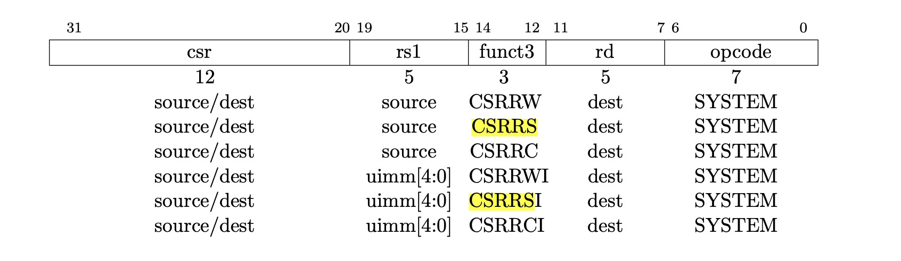
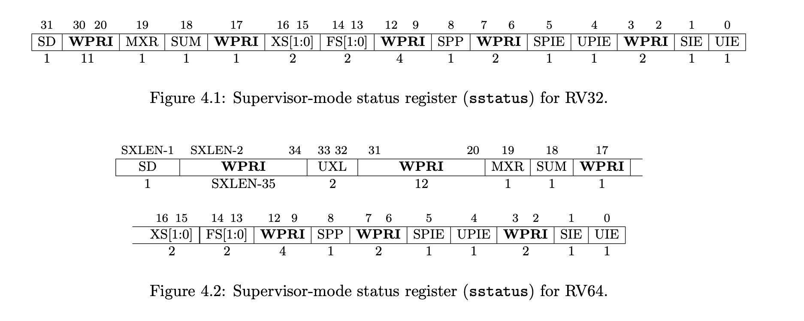
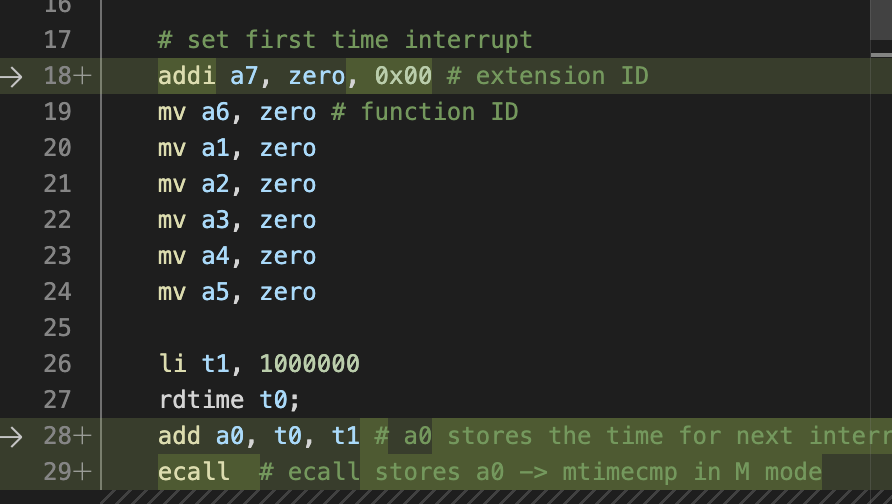
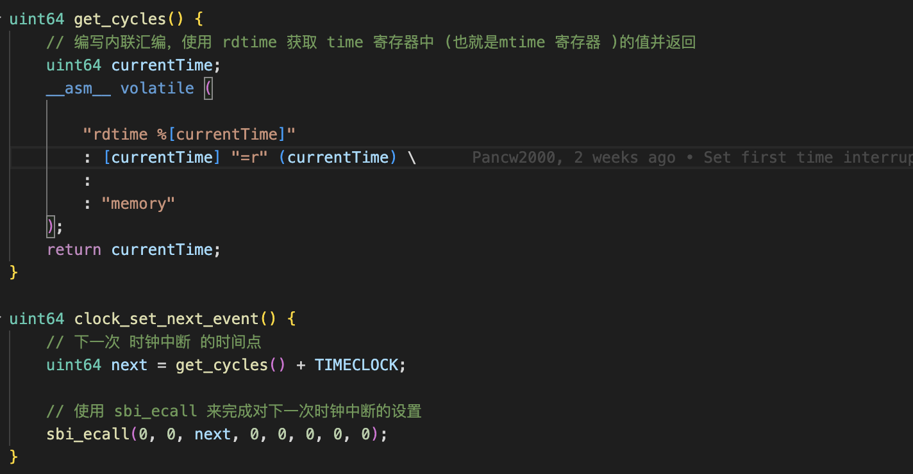
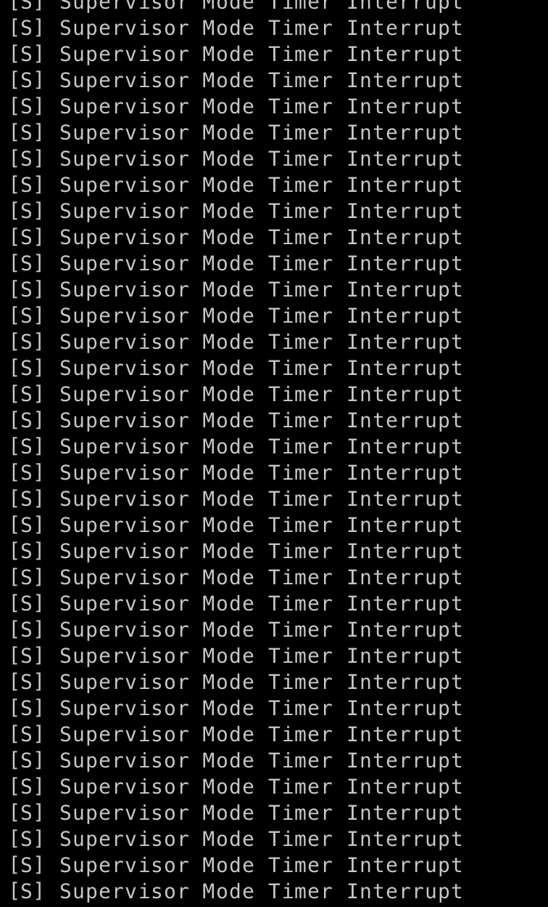
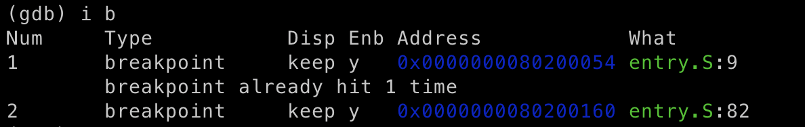
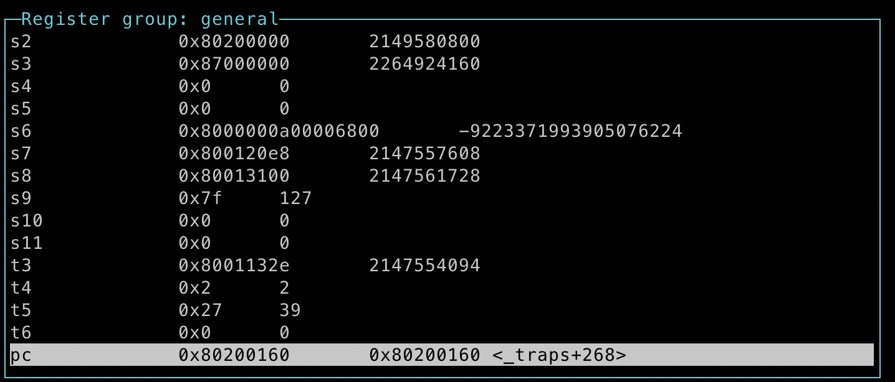
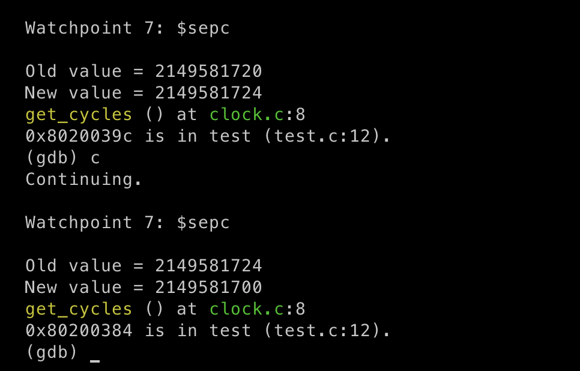

# lab2-时钟中断处理

## 理解原理

### M态是怎么知道中断发生并通知我们(S态的)?

所有的中断源头都是硬件. 硬件通过逻辑电路产生一个信号, 这个信号连到CPU内, CPU再把这个硬件传来的中断信号和某些CSR的特定位数相关联起来. 当中断发生时, M态中的那些CSR (e.g. `mepc`, `mcause`, `mie`...) 发生了改变, PC由于CPU逻辑电路自动跳到`mtvec`(处理中断的地方), 其他CSR也根据逻辑电路被修改.

M态的 trap_handler 做了一些基本处理后(openSBI), 把`mepc` 和 `mcause` 的值拷贝到 `sepc`, `scause`中(还有其他类似的CSR), 这样S态也就能知道硬件到底发生了什么中断了.

这部分内容属于组成/体系里我们烧到板子上跑的那一部分, 不需要我们在OS课程里写, 但是要知道背后的原理.

### interrupt (在lab2里特指时钟中断) 发生时, 哪些寄存器是M态改变的, 哪些寄存器需要我们自己用CSR相关指令改变?

#### M态改变的(S态)寄存器, 直接读取即可: 

`sepc`: 中断处理完后返回该执行的第一条汇编指令地址(`sret`指令返回地址)

 `scause`: 中断种类

 `stval`: 如果中断时发生了缺页, 那么`stval`会被设为缺页的地址

`mtime`: M态的计时器, 随着时间不断变化, 在S态可以通过指令 `rdtime`向M态请求读取`mtime`

#### 需要我们自己改的寄存器:

`sstatus`: 需要设置 `sstatus[SIE] = 1` 来打开S态的中断

 `sie`: 需要设置 `sie[STIE] = 1` 来打开时钟中断

`stvec`: 中断发生时PC跳转的位置, 在开启中断前需要让`stvec`等同于`_traps`

`sstatus`, `sie`, `stvec` 都是属于刚开始设置以后就基本不会再变化的CSR, 只需要设置1次

`mtimecmp`: 保存着下一次时钟中断发生的时间点，当 `mtime` 的值大于或等于 `mtimecmp` 的值，系统就会触发一次时钟中断. 我们需要在每一次时钟中断发生后(以及刚开始) 都重新设置`mtimecmp`的值, 让时钟中断不停发生.


## 代码流程

### 设置第一次时钟中断

#### 设置 `sie[STIE] = 1`

设置`sie`第6位为1, 第一反应就是使用 `CSRRWI x0, sie, 0x20`. 但是在编译报警告后我发现不对劲: `CSRRWI` 最多只能接受5位立即数, 没法设置第6位. 只能先用寄存器保存`0x20`, 再用`CSRRW` 来设置`sie[STIE]`

 


 

 

#### 设置 `sstatus[SIE] = 1`

在吸取了教训后我首先查看了`sstatus`的格式, 发现RV64下` sstatus[SIE]`为第二位, 直接用 `CSRRWI` 设置



#### 设置` stvec = &_traps`

用 `la` 指令读出`_traps`的地址后再赋给 `stvec` 即可


调用 `ecall` 来设置 `mtime`

在lab1中我们已经提到过调用 `ecall` 时各个寄存器的作用了. 需要分清楚 c代码中 `sbi_ecall()` 和直接在汇编代码中设置寄存器然后调用 `ecall` , 参数的位置是不同的(我就是混淆然后把a2当成了存放time的寄存器导致卡了很久)

| 参数名                                 | ext  | fid  | arg0 | arg1 | arg2 | arg3 | arg4 | arg5 |
| -------------------------------------- | ---- | ---- | ---- | ---- | ---- | ---- | ---- | ---- |
| 进入`sbi_ecall()`时参数对应的寄存器    | a0   | a1   | a2   | a3   | a4   | a5   | a6   | a7   |
| 参数对应的值                           | 0x0  | 0x0  | time | 0x0  | 0x0  | 0x0  | 0x0  | 0x0  |
| 执行`ecall`进入M态之前参数对应的寄存器 | a7   | a6   | a0   | a1   | a2   | a3   | a4   | a5   |

 


### 在 trap_handler 中设置下一次时钟中断

`trap_handler` 中利用`clock_set_net_event` 来设置下一次时钟中断, 其中用到的 `get_cycles` 等同于汇编里的 `rdtime`. 而 `sbi_ecall` 更不用说了, 在lab1中我们已经实现过了, 注意下参数的位置即可.

 

```sh
make run
```

 

> 说明我们设置时钟中断成功了!

### 在 `_traps` 中保存和恢复寄存器

接下来我们只需要在 `_traps` 中保存和恢复寄存器即可


#### 如何验证寄存器保存/恢复正确?

1. 在`entry.S` 保存前(保存后也可以, 因为寄存器值除了`sp`都没变化)和sret处分别打上断点, 并在`gdb`里用`continue`执行到第一个断点处

 

2.  用`layout regs` 查看寄存器的值

3. `continue` 执行到第二个断点处, 此时如果寄存器的值和上一个断点相比有变化, 会用灰色高亮显示, 例如 `PC`.

   检查发现过后除了`PC`其他寄存器都没有变化, 说明我们寄存器保存/恢复代码功能实现了

    

#### 为什么需要保存 `sepc`, 或者为什么不需要?

其实我的lab2代码里并没有在 `context_switch` 时保存`sepc`, 因为在仔细思考后我发现 `sepc` 只有在中断有可能递归发生时(在处理中断的过程中又发生了中断) 才需要保存和恢复. 但由于lab2中我们的中断只有可能是间隔1秒左右发生的时钟中断, 根本不可能发生递归中断, 也就没有必要设置`spec`.

##### 怎么验证我的想法, 查看 `sepc` 变化时的值(相应的代码行)

为了验证我的想法, 每次在`sepc`变化时我需要让gdb打印出 `sepc`存储的返回地址, 其中 `command 7` 的作用是当到达断点7时设置相应的执行命令, 而 ` list *(void**) ($sepc)` 负责打印出 `sepc` 存储的地址(gdb还会打印出所在的文件代码行, 例如 `test.c:12`)

```sh
watch $sepc
command 7 # use the number of watch $sepc
> list *(void**) ($sepc)
```

##### 结果

 

每次`spec`发生变化时都发生在`clock.c:8` (理论上应该在 `test.c` 发生中断的那一行变化, 但 `sepc` 的改变是M态操作的, gdb展示的结果不一定准确, 但我们知道`sepc`一直指向 `test.c` 中发生中断的那一行, 除此之外没有任何变化, 确实不需要在 `context_switch` 中保存 )


### Reference

[How does origin/HEAD get set?](https://stackoverflow.com/questions/8839958/how-does-origin-head-get-set)

[How to load an immediate number to a register in RV32I Base Instruction Set?](https://stackoverflow.com/questions/56781564/how-to-load-an-immediate-number-to-a-register-in-rv32i-base-instruction-set)

[RISC-V build 32-bit constants with LUI and ADDI](https://stackoverflow.com/questions/50742420/risc-v-build-32-bit-constants-with-lui-and-addi)

[How is an Interrupt handled in Linux?](https://unix.stackexchange.com/questions/5788/how-is-an-interrupt-handled-in-linux)

[RISC-V Interrupt Handling Flow](https://stackoverflow.com/questions/61913210/risc-v-interrupt-handling-flow)

[how to get source code line from instruction address in gdb](https://stackoverflow.com/questions/50162112/how-to-get-source-code-line-from-instruction-address-in-gdb)

[GDB Print Value Relative to Register](https://stackoverflow.com/questions/19555256/gdb-print-value-relative-to-register)

