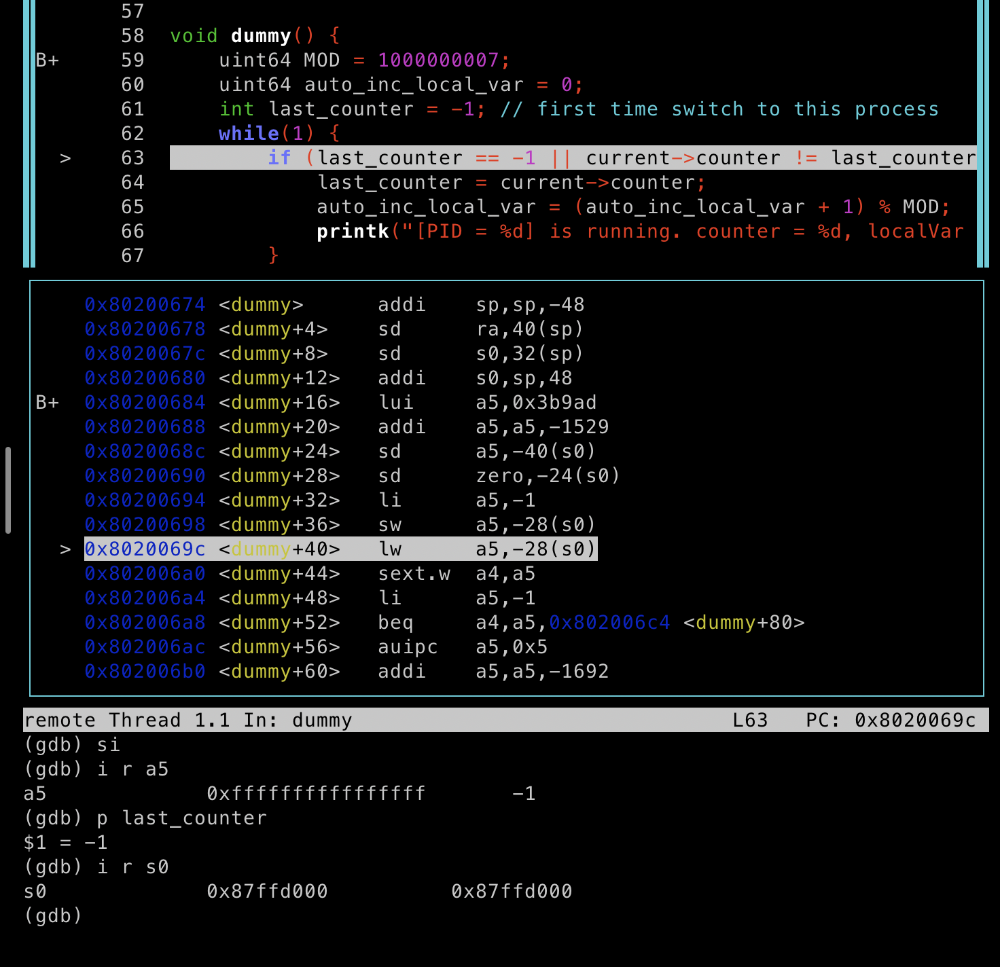
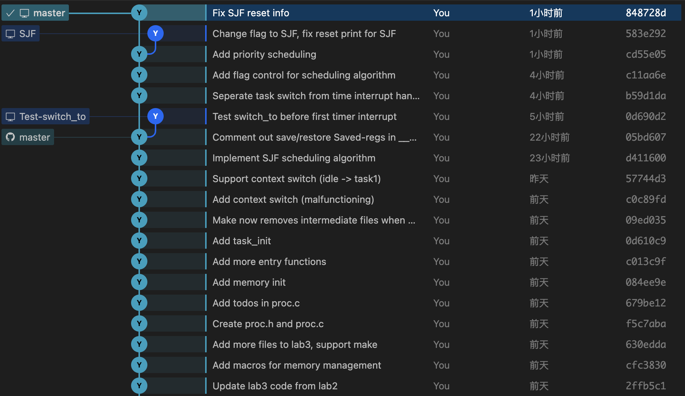

# lab3 - 内核线程调度

## 理解原理

### 用一个比喻理解内核线程的切换

如果把多个内核线程看作是人, 那么同一时刻只能有一个人醒着, `callee-saved` 寄存器 就像是人身上穿的衣服,` caller-saved` 寄存器就像是人袋子里装的东西(相对来说无关紧要). 操作系统只有一套衣服(但它能改变衣服的样式), 它要保证每个人(`task`)醒来(被切换到)的时候穿的衣服和被敲晕前是一样的. 为了实现这个目的操作系统在把人(`task`)敲晕(切换走)之前需要为身上的衣服拍一张照 (_`_switch_to`中的 `save state`), 把人叫醒之前按照片改变衣服的样式, 再给它穿上. 这样虽然我们只有一套衣服(寄存器), 但是能让多个人在醒着的时候都穿上衣服(能保证callee-saved寄存器和被敲晕时一样).

### 整体流程

   


### 分离线程调度和时钟中断

根据流程图, 既然线程中断是由时钟中断引起的, 而时钟中断前后分别保存和恢复了所有的寄存器, 那在`__switch_to` 中何必保存s类寄存器呢?. 如果只保存/恢复 `ra` 和 `sp` 以支持回到 `_traps` 中的 `_restore_context`,  让它做其他寄存器的恢复行不行呢?


#### 当线程调度依赖时钟中断时

为了验证我的想法, 在 `05bd607` 这个 commit 中我把 `__switch_to`里除 `ra` 和 `sp` 的寄存器保存/恢复代码全部注释掉了

 

  

```sh
git checkout 05bd607
make run
```

我发现内核线程的切换还能正常运作,  而且每次从 `__switch_to` 返回前 `sp` 均设置正确

 

 

> `sp`的检查, 有时候末尾是 '28' 而不是 '48' 是因为在`printk` 中申请了额外的栈空间后发生了中断

 

 

> 流程检查, 从`__switch_to` 一路返回到 `_restore_context`

#### 修改代码, 让时钟中断能够独立运行

这个问题困扰了我很久, 最后还是在助教的提示下才意识到这点: 虽然在lab3里面我们所有的线程调度都是发生在时钟中断中的, 但是实际的操作系统中线程中断可能发生在任何地方(例如`yield`)

为此我创建了branch `Test-switch_to`

 

```sh
git switch Test-switch_to
```

我增加了`__switch_to` 中保存/恢复寄存器的代码(除了ra和sp还保存了s类寄存器), 并且在进程初始化完成, 打开时钟中断前就调用`switch_to`, 来测试它的独立性.

```c
//proc.c
...
    printk("...proc_init done!\n");
    switch_to(task[1]); // while loop in dummy()
    switch_to(task[2]); // will not execute
    switch_to(task[1]);
    switch_to(task[2]);
...

```

 

> 可以看到switch_to 确实完成了一次线程的切换
>


#### 为什么 __switch_to 中不需要保存 caller-saved 寄存器? 为什么需要保存 callee-saved 寄存器?

理解这个问题, 从单个内核线程的角度看比较容易. 对于某个特定的内核线程(我们假设它叫`taskA`),` switch_to `就像是一个普通的函数, 只不过这个函数做的工作是为别的内核线程服务. 对于 taskA 来说, 当它调用switch_to时, 就好像被敲晕一样, 只有直到操作系统把它叫醒(别的内核线程切换到了`taskA`), `taskA` 才发现 `switch_to` 已经执行完了. 对于 riscv 来说, 从进入某个函数到退出某个函数, 只要求 sp, ra, s类寄存器(callee-saved registers) 的值不发生变化, 其他 a/t 类寄存器(caller-saved registers) 就算发生变化也无所谓. 


### c代码中的“变量” 存储在哪里?

#### 局部变量 (e.g. `auto_inc_local_var`): 存储在每个线程的栈当中, 每个线程都有一份

每个task的变量都应该放在task struct的栈当中(例如`auto_inc_local_var`), 它们的地址应该为 `0x87ffxxxx` 这样的形式

 

> 在gdb里可以把断点设到`dummy` 中, 然后查看汇编代码是从哪里读取局部变量的(看`sp`/`s0`)

#### OS的变量(e.g. `current`): 存储在OS的栈当中, 只有一份

 `current` 在所有 task 初始化之前就存在了. `current`的存放位置在(或者说`&current`指向) 整个OS的栈区(`0x8020xxxx`) 而不是某个线程的栈(`0x87ffxxxx`)

   

> 汇编代码中`... = current->counter`对应的代码. 
>
> 1. 先用 `auipc` 和 `addi` 获取 `&current`.
> 2. 用 `ld` 指令获取`current`
> 3. 用 `ld` 指令获取 `current` 指向的 `task_struct` 中的数据


## 写代码的流程

因为之前写报告时把整个lab实现的过程都忘的差不多了, 这次我决定按照 git log 中的 commit 来写, 挑一些我认为比较重要的 commit 来分享一下过程 (按最一开始到结束的顺序). 中间贴的代码由于是某个commit的产物, 可能是存在错误的. 

每个commit的分析包括:

1. 运行结果(即使是错误的, 如果有的话)
2. 和之前的版本相比有哪些进展
3. 还有哪些缺陷

由于这个commit的进展大概率是修复上一个commit的缺陷, 因此进展/缺陷一般只挑一个说

 

> commit graph

切换到具体某个commit的代码:

```sh
git checkout COMMIT_SHA1
make run
```


#### Add context switch (malfunctioning)

##### 运行结果

 

##### 缺陷

这个 commit 完成了内存/内核线程的初始化. 我尝试从 `idle` 线程切换到` task[1]`(即更改`current`, 检查`current`的值在`switch_to`执行后是否发生变化, 先不管寄存器是否保存正确), 但很遗憾结果是失败的, 操作系统一直在运行`idle`线程. 原因在于我没有理解 `current` 是怎么切换内核线程的 (需要我们手动执行 `current = next`, `current `不会自己切换)

 

> 左: Add context switch
>
> 右: 下一个commit


#### Support context switch (idle -> task1)

##### 运行结果

 

> 完成了 `idle` ->` task[1] `的切换, 但是由于我们还没有实现调度算法, 所以switch只发生了一次(事实上我们是在`do_timer`中调用`switch_to` 而非 `schedule`来测试的)
>
>  

#### Implement SJF scheduling algorithm

##### 运行结果

 


##### 进展

 

> 实现了SJF算法, 但说实话这个算法本身并不是lab3的难点

#### Seperate task switch from time interrupt handling

运行结果和上个commit没有什么区别, 但是在原理上我把线程切换和时钟中断分离开了

 

 

这个commit中我终于理解了内核线程的切换需要独立于时钟中断, 之前我一直通过在 `__dummy`中设置`ra`的方式来让后面的线程切换直接跳到 `restore_context`, 并且把`__switch_to`中保存s系寄存器的代码全部注释掉, 在理解原理之后修改回了正确的方式.


#### 最终结果

我把优先级调度算法作为分支 `master` 的调度算法, 另新开了一个分支 `SJF`. 两者的唯一区别就是 `Makefile` 中 `CFLAG` 的不同. 这样需要执行 SJF 算法时就不用自己改 `Makefile`了, 直接切换到 SJF 分支即可

##### priority

```sh
# priority
git switch master
make run
```

 

##### SJF

```sh
# SJF
git switch SJF
make run
```

 

## 其他问题

### 汇编代码-c代码调用函数

这个问题的来源是怎么在 `switch_to`(c代码) 中调用 `__switch_to` (汇编代码)

#### 汇编代码中怎么执行用c写的函数

直接jal就行了, 链接的时候linker会自动帮你找的

#### c代码中怎么执行汇编代码的某一段(例如`__switch_to:`)

第一种思路: 用内联汇编

第二种思路: 在c代码中先extern, 再直接调用, 在编译时直接调用的c代码会被编译成对应的汇编代码, 本质上和思路1一样

注意这样操作的汇编代码一般都用 a0, a1 接收参数


#### 为什么要有 __dummy 和 dummy?

`__dummy` 只有在进程第一次被调度到时才会进入, `__dummy` 最后 sret 将会跳转到 dummy, dummy 中有个无限循环, 就不会再执行`__dummy`了

#### 为什么__dummy 中要用sret而不是ret?

理论上 `__dummy` 属于内核部分而非用户部分(例如`dummy`), 因为之前我们是通过时钟中断进入的, 如果不用 `sret` 而用 `ret` 返回 `dummy` 的话, `dummy` 就算作内核部分了

#### 内核线程第一次被调度和第二次(及以后)被调度的区别?

第一次调度: 在`__switch_to` 函数完成后,  会执行汇编代码`ret`(`PC<- $ra`), 由于我们在`task_init()`中把所有`task_struct`的`ra`设置为了`__dummy`, 在每个`switch_to`完成后会自动回到`__dummy`, 而不会回到`switch_to`函数. 最后从`__dummy`退出时钟中断并从内核线程返回到用户线程 `dummy`的开头

第一次调度时, 

第二次调度(及以后): `__switch_to`最后的`ret` 将返回 `switch_to`的末尾(为什么? 因为c代码`__switch_to`编译出来的汇编代码是` jal __switch_to`), 并且从 `switch_to` 一路返回到 `_traps` 中的 `_restore_context` 恢复时钟中断的内容并且从中断退出返回 `dummy`中`while`循环上一次我们执行的指令

#### 为什么要有`switch_to(next)` 和 `__switch_to(prev, next)`?

理论上可以用内联汇编写, 但是分开来更加干净


### reference

#### gdb

[How can I make gdb save the command history?](https://stackoverflow.com/questions/3176800/how-can-i-make-gdb-save-the-command-history)

在TUI模式下需要用 control + n / control + p 切换下一条/上一条历史记录

gdb target remote 避免某次重新输入

gdb sret not executing

#### makefile

[makefiles CFLAGS](https://stackoverflow.com/questions/80657/makefiles-cflags)

#### linker

[Difference between Executable and Linkable Format(.elf) and Object(.o) file](https://stackoverflow.com/questions/53210259/difference-between-executable-and-linkable-format-elf-and-object-o-file)

[Sections](https://michaeljclark.github.io/asm.html)

[Linker scripts](https://users.informatik.haw-hamburg.de/~krabat/FH-Labor/gnupro/5_GNUPro_Utilities/c_Using_LD/ldLinker_scripts.html#Output_section_description)

[assemly directives](https://ftp.gnu.org/old-gnu/Manuals/gas-2.9.1/html_chapter/as_7.html)

